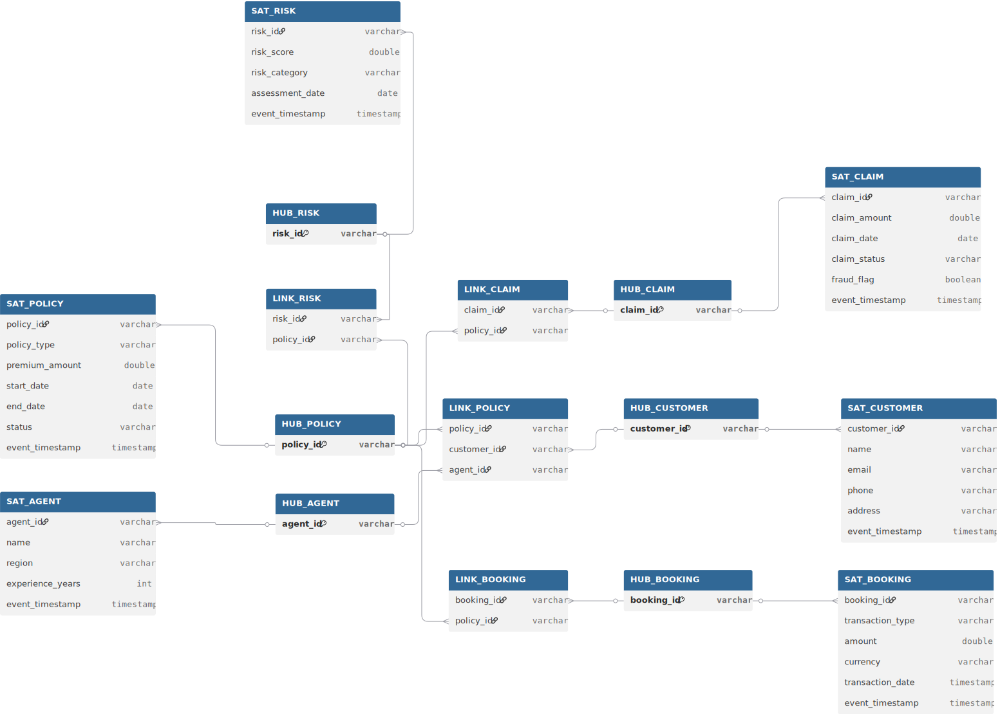

# Real-Time Insurance Data Platform

This project demonstrates a scalable data engineering solution built on Databricks for processing both real-time and batch insurance data.

---

## 🚀 Problem Statement

Insurance systems generate high-volume data across multiple domains such as claims, policies, agents, and risk assessments. This data is often:

* Fragmented across systems
* Inconsistent in structure
* Difficult to process in real-time

This project addresses these challenges by building a unified, scalable data platform that enables:

* Real-time data ingestion using Kafka
* Batch ingestion for master/reference data
* Data standardization and schema enforcement
* Flexible modeling using Raw Data Vault (RDV)
* Analytics-ready star schema for reporting

---

## 🏗️ Architecture Overview

```text
Kafka (Streaming) + Batch (ADLS)
            ↓
        Bronze Layer (Delta)
            ↓
     Standardization Layer
            ↓
   Raw Data Vault (RDV)
            ↓
     Star Schema (Gold)
            ↓
        Power BI
```

---

## 🧩 Data Model (Raw Data Vault)

The platform uses a **Raw Data Vault (RDV)** model to maintain flexibility, scalability, and historical tracking.

### 📊 RDV Diagram

<p align="center">
  <a href="src/insurance/data_modeling/RDV_Model.svg">
    
  </a>
</p>

---

### 🧠 RDV Concepts Used

* **HUB** → Core business entities (Customer, Policy, Agent, etc.)
* **LINK** → Relationships between entities (e.g., Customer–Policy)
* **SATELLITE** → Descriptive attributes and historical data

---

## ⚙️ Tech Stack

* **Databricks** (Structured Streaming, Delta Lake)
* **PySpark**
* **Apache Kafka**
* **Azure Data Lake Storage (ADLS Gen2)**
* **Databricks Asset Bundles (DAB)**
* **Power BI**

---

## 🔄 Data Flow

### 1. Ingestion

* Streaming data ingested via Kafka topics:

  * claims, policies, booking_line, risk_assessment
* Batch data (master data):

  * customers, agents from ADLS

---

### 2. Bronze Layer

* Raw data stored in Delta tables
* Schema applied using predefined StructType

---

### 3. Standardization Layer

* JSON parsing and flattening
* Data validation and enrichment
* Handling corrupt records

---

### 4. Raw Data Vault (RDV)

* Separation into:

  * Hubs (business keys)
  * Links (relationships)
  * Satellites (attributes + history)

---

### 5. Star Schema (Gold Layer)

* Optimized for reporting
* Fact and dimension tables created
* Used for Power BI dashboards

---

## 📁 Project Structure

```text
insurance/
├── ingestion/
│   ├── streaming/
│   ├── batch/
│   └── graph/
├── processing/
├── utils/
├── data_modeling/
│   ├── rdv_model.dbml
│   └── RDV_Model.svg
```

---

## 🎯 Key Highlights

* End-to-end pipeline (Streaming + Batch)
* Modular design using Databricks Asset Bundles
* Schema-driven data processing
* Data Vault modeling for scalability
* Clean separation of Bronze → Silver → Gold layers

---

## 📌 Future Enhancements

* Automated data lineage (OpenMetadata)
* Real-time anomaly/fraud detection
* CI/CD integration with GitHub Actions
* Data quality checks using expectations

---

## 🧠 Learnings

* Designing scalable data pipelines on Databricks
* Implementing Data Vault modeling
* Handling streaming + batch integration
* Structuring projects using DAB

---
